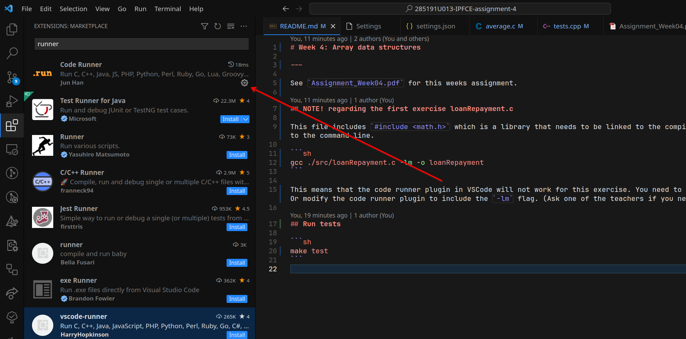
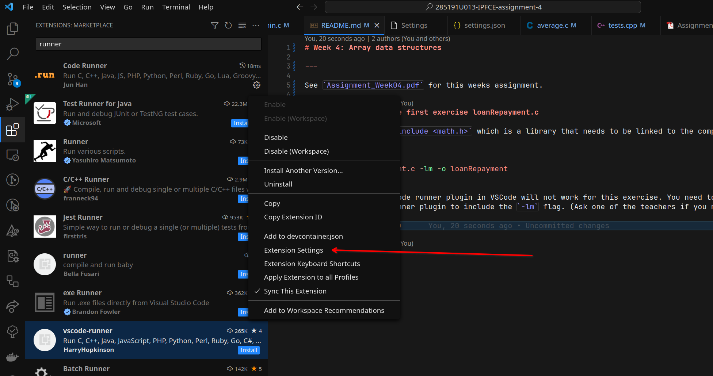
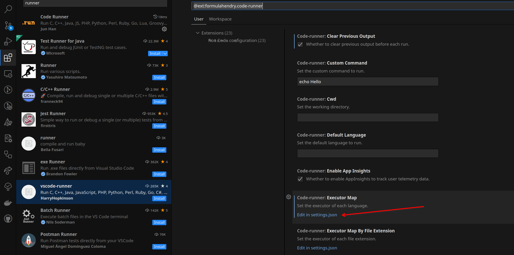
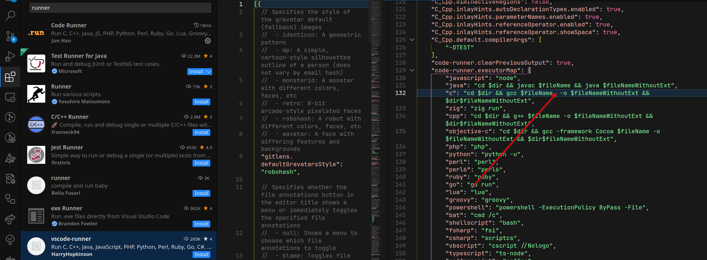

# Week 4: Array data structures

---

See `Assignment_Week04.pdf` for this weeks assignment.


## Run tests

```sh
make test
```

## NOTE! regarding the first exercise loanRepayment.c

This file includes `#include <math.h>` which is a library that needs to be linked to the compiler. This is done by adding `-lm` to the command line.

```sh
gcc ./src/loanRepayment.c -lm -o loanRepayment
```

This means that the code runner plugin in VSCode will not work for this exercise. You need to run the code from the command line. Or modify the code runner plugin to include the `-lm` flag. (Ask one of the teachers if you need help with this.)

The screenshot below shows how to modify the code runner plugin in VSCode.










Save the file and now it should work!
